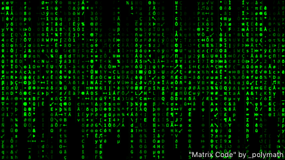
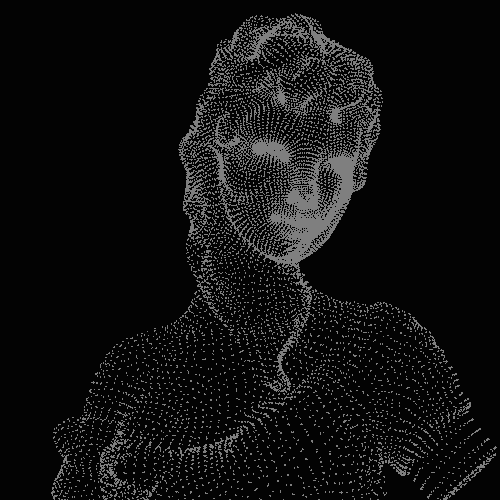
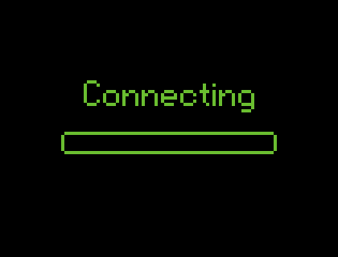
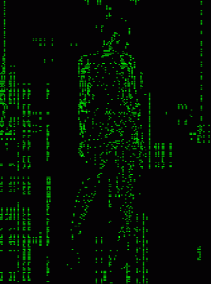

<!-- 🌌 UNIVERSE HEADER -->

<h1 align="center">Hi 👋 I'm Dahami</h1>

<h3 align="center">
UI/UX Designer • Frontend Developer • Creative Tech Student
</h3>

---

<!-- 🌌 SPACE ANIMATION -->

---

# 🌿 About Me

- 🌱 Currently learning **Internet of Things (IoT)**
- 💬 Ask me about **Java, UI/UX, Frontend Development**
- 📫 Reach me at **dahamijayawardhane@gmail.com**
- 🧘 I enjoy **nature, meditation, and universe inspiration**
- ⚡ Fun fact: **Call me Dahami**

---

# 🌐 Connect With Me

---

# 🚀 Languages & Tools

---

# 🌌 My Skill Galaxy

### 🚀 Core Technologies

### 🎨 Design Universe

### 🌍 Backend Planet

### 🛰 Development Tools

---

<!-- 🌿 NATURE ANIMATION -->

# 🏆 Developer Achievements

---

# 📈 Activity Graph

---

# 🐍 Contribution Snake

---

<!-- 🌌 FOOTER -->

